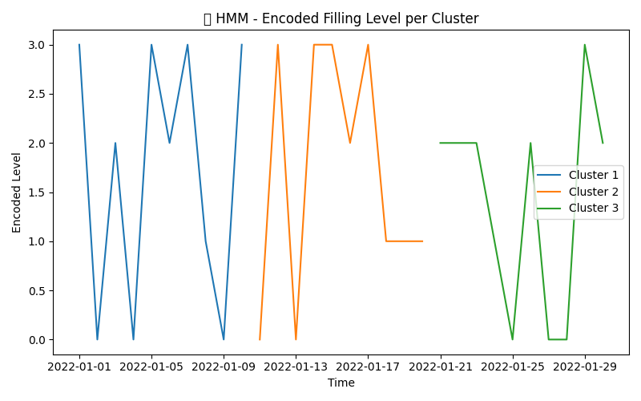

# 🤖 HMM Model Test Summary
✅ **Model trained successfully.**

## 🔁 Transition Matrix
|           0 |           1 |            2 |           3 |
|------------:|------------:|-------------:|------------:|
| 0.000366658 | 0.267414    | 0.356354     | 0.375865    |
| 0.286291    | 0.333333    | 2.60884e-185 | 0.380376    |
| 1           | 7.0077e-182 | 7.97736e-199 | 6.15654e-18 |
| 0.999947    | 5.65677e-06 | 1.76733e-05  | 2.95967e-05 |

---

