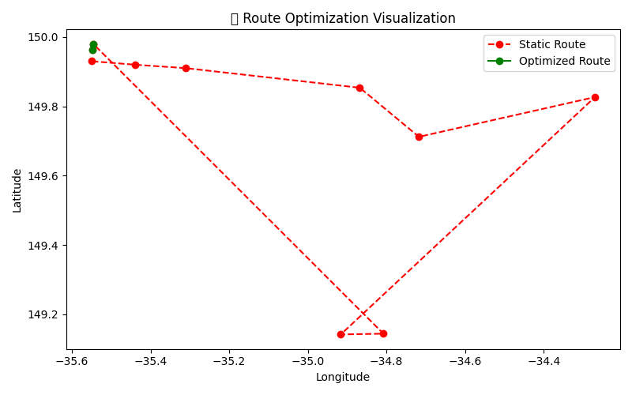

# 🚛 Route Optimization Test Summary
📅 Date: 2025-03-21 10:27:14

## 📊 Key Metrics
- 🟢 **Optimized Route Distance**: 1.43 km
- 🔴 **Static Route Distance**: 368.45 km
- 📍 **Optimized Route Stops**: 2
- 📍 **Static Route Stops**: 10

## 🧭 Coordinates Preview
- Optimized (first 5): [(-35.5469786, 149.9639965), (-35.5453317, 149.9796274)]
- Static (first 5): [[-35.5469786, 149.9639965], [-35.5453317, 149.9796274], [-34.8077422, 149.1441895], [-34.9161423, 149.1419426], [-34.2696789, 149.8265735]]

## 🖼️ Route Visualization

✅ *Generated automatically by test script.*
